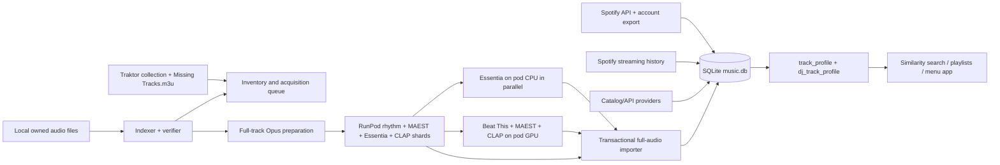

# Architecture and file map

## System overview

## Reliability model

- SQLite runs in WAL mode with a 90-second busy timeout.
- API/provider workers own independent retry loops. One slow provider does not
  block the others.
- Result formats are append-only JSONL or database rows committed per track.
- Manifests and state files are written to a partial file and atomically renamed.
- LaunchAgents use `RunAtLoad` and appropriate `KeepAlive` rules.
- Network jobs wait offline; cached local models continue without internet.
- Cloud shards are immutable, checksum-verified and resumable.
- RunPod pods have server-side stop/terminate deadlines and client-side cleanup.
- The disk guard enforces a 50 GiB minimum free-space policy.

## Main flows

### 1. Spotify and listening data

`export.py` exports owned Spotify playlists plus Liked Songs to
`data/library_export.json`. `build_music_db.py` and
`import_spotify_account.py` populate `tracks`. `import_streaming_history.py`
imports Spotify Extended Streaming History and deduplicates events by hash;
`resolve_stream_history.py` resolves history rows not already in the library.

### 2. Catalog/API enrichment

`enrichment_daemon.py` supervises independent Spotify metadata/album/genre,
Last.fm, MusicBrainz, ReccoBeats, OneTagger/Discogs/Bandcamp, Deezer,
TheAudioDB, history resolver and semantic-derivation workers. FreqBlog is added
when enabled. SoundNet remains disabled by decision.

### 3. Local file reconciliation

`index_audio_files.py` scans configured roots, using Spotify IDs and ISRCs
first, then conservative title/artist/duration matching.
`sync_library_inventory.py` reconciles:

- `data/music.db` Spotify tracks;
- the Traktor NML collection;
- `/Users/jakub/Documents/Missing Tracks.m3u`;
- physically present indexed files.

It builds `acquisition_queue` but does not download media.
`verify_audio_files.py` verifies that files exist, are complete and decodable.

### 4. Full-track quality-first audio pass

`prepare_cloud_audio_pilot.py --full-track` reads matched originals and creates
mono 48 kHz Opus 192 kbps analysis copies in `data/cloud_full/clips`. It uses
one background-priority FFmpeg worker to minimize laptop heat and writes
`data/cloud_full/manifest.csv` atomically.

Two local followers remain available as disabled offline fallbacks:

- `follow_local_essentia.py` -> `local-essentia-results.jsonl` -> importer;
- `follow_local_rhythm.py` -> `local-rhythm-results.jsonl` -> importer.

The active cloud-first production is:

1. `build_cloud_full_shard.py` hard-links 100 ready clips and bundles code,
   manifest and clips into a checksum-protected tar;
2. `cloud_production_orchestrator.py` checks balance/spend and runs one
   incomplete shard at a time;
3. `runpod_full_shard.py` creates a bounded GPU pod, uploads, executes Essentia
   concurrently with rhythm/MAEST/CLAP, downloads results and deletes the pod;
4. `import_full_audio_results.py` stores raw artifacts, temporal matrices,
   aggregate embeddings, tags, attributes and conservative consensus.

### 5. Search and outputs

`find_similar.py` combines:

- BPM with half/double-tempo distance;
- harmonic/Camelot key distance;
- energy, danceability, valence and other audio features;
- IDF-weighted genre/subgenre/mood/instrument/voice overlap;
- beat presence and rhythm pattern;
- CLAP and MAEST cosine similarity when both seed and candidate have the same
  model version.

`query_music.py` provides basic FTS search. Playlist scripts produce Spotify
or Soundiiz outputs. The menu app exposes status and pause/resume controls.

## File map

### Core database and reporting

| File | Responsibility |
|---|---|
| `musicdb.py` | Schema, migrations, WAL connection and source-run recording |
| `build_music_db.py` | Initial library JSON import |
| `coverage_report.py` | Provider and field coverage report |
| `query_music.py` | Basic full-text search |
| `find_similar.py` | DJ-oriented nearest-track ranking |
| `audio_enrichment_status.py` | Older local audio pipeline status |
| `sync_status.py` | Menu/CLI inventory status snapshot |

### Spotify and playlist tools

| File | Responsibility |
|---|---|
| `spotify_client.py` | OAuth refresh, API requests and 429 handling |
| `export.py` | Owned playlists + Liked Songs export |
| `genre_line.py` | Original Indie-vs-ecstatic taste boundary |
| `classify.py`, `strict_classification.py`, `merge_classification.py` | Original Indie classification paths |
| `build_playlist.py` | Resumable Indie Sort playlist writer |
| `build_liked_playlist.py`, `extend_liked_playlist.py` | Liked-only Indie playlist, extended to 500 |
| `build_sensual_playlist.py` | 200-track sensual reference playlist ranker |
| `build_blindspot_playlists.py` | Four resumable Spotify-only local blindspot playlists |
| `export_soundiiz.py` | Soundiiz-compatible export |

### Catalog enrichment

`enrich_spotify_metadata.py`, `enrich_spotify_albums.py`,
`sync_spotify_genres.py`, `enrich_lastfm*.py`, `enrich_musicbrainz.py`,
`enrich_reccobeats.py`, `import_hf_spotify_features.py`,
`enrich_freqblog*.py`, `enrich_deezer.py`, `enrich_theaudiodb.py`,
`enrich_acousticbrainz.py`, `onetagger_db_bridge.py`,
`derive_playlist_tags.py` and `derive_semantic_tags.py`.

### Audio analysis

| File | Responsibility |
|---|---|
| `analyze_local_rhythm.py` | Beat This + DSP beat/rhythm classifier |
| `analyze_local_genres.py` | Pinned MAEST Discogs400 genre/style model |
| `analyze_local_semantics.py` | CLAP vocabulary and embeddings |
| `analyze_essentia_full.py` | Shared EffNet embedding + 19 supervised heads |
| `audio_taxonomy.py` | Controlled detailed genre/mood/instrument/voice vocabulary |
| `cloud_audio_full.py` | Full-track tiling, inference and temporal output |
| `import_full_audio_results.py` | Provenance-preserving import and consensus |
| `run_local_audio_pipeline.py` | Earlier sequential local audio runner |

### Cloud orchestration

`build_cloud_full_smoke_bundle.sh`, `runpod_full_smoke.py`,
`build_cloud_full_shard.py`, `runpod_full_shard.py`,
`cloud_production_orchestrator.py`, `runpod_pilot.py` and the
`com.jakub.music-db-*.plist` files.

### Local sync and UX

`index_audio_files.py`, `verify_audio_files.py`,
`sync_library_inventory.py`, `sync_control.py`, `enrichment_daemon.py`,
`menu_app/`, `build_menu_app.sh` and `dist/Music Library Sync.app`.

### OneTagger work

- `vendor/onetagger/`: upstream fork with an uncommitted `crates/onetagger-db`
  experiment and Cargo workspace edit;
- `onetagger-db/`: standalone compiled Rust SQL feeder; release binary exists;
- `onetagger_db_bridge.py`: immediate Python database-only Discogs bridge;
- `import_onetagger.py`: imports tags embedded in real audio files.

### Runtime/data directories

| Path | Meaning |
|---|---|
| `data/music.db*` | SQLite DB, WAL and shared-memory files |
| `data/cloud_full/` | Full-track analysis copies, manifest and local results |
| `data/cloud_full_shards/` | Immutable cloud shard bundles/state/results |
| `data/cloud_full_smoke/` | Successful three-track full-pipeline smoke |
| `data/onetagger_cache/` | Cached provider responses |
| `vendor/essentia-models/` | Cached official supervised model files |
| `.venv/` | Main Python environment |
| `.audio-venv/` | Beat This/CLAP/audio environment |
| `.essentia-venv/` | Separate Essentia-TensorFlow environment |

`data/`, environments, models and credentials are runtime assets and must not
be blindly committed or deleted.
